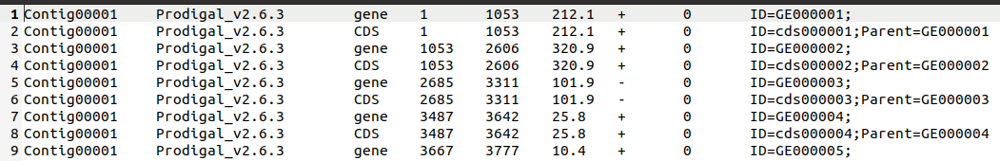

# WangLab
Provide several simple bioinformatic scripts

## Introduction

This project was written by a master student who studied under Dr. Wang Qiyao's supervision.
This project contains several simple bioinformatic and sequence operating scripts and will
not update nor provide support when this student is graduated.

## Install

The easiest way to install WangLab in through pip:

```bash
pip install WangLab
```

If TIS/RNA_seq/ChIP_seq modules are used, users need to manually install Bowtie through conda or apt. **Note**: Bowtie do not provide releases for **Windows** systems by the time this document is written.

```bash
# conda:
conda install bowtie -c bioconda

# apt
sudo apt install bowtie
```


## Usage

See [Sequence_operate](./docs/Sequence_operate.md), [ChIP_seq](./docs/ChIP_seq.md), [TIS](./docs/TIS.md), [RNA_seq](./docs/RNA_seq.md) in docs

## Example Usage

Here are examples of how to use subcommands in different modules.

### Sequence_operate

- [extract_seqs](./docs/Sequence_operate.md#extract_seqs)

```bash
wanglab extract_seqs -i pos.txt -r ref.fa -o out1.fa
```

In this example, pos.txt contain 3 columns, each represent name ,start ,end. ref.fa is contain a single sequence. The program will extract sequences between start and end, and output to out1.fa. 

```bash
wanglab extract_seqs -i names.txt -r seqs.fa -o out2.fa
```

In this example, names.txt contain 1 column, which is the names that will be extracted. seqs.fa contain several sequences. The program will extract sequences whose names are in names.txt, and output to out2.fa

- [calc_content](./docs/Sequence_operate.md#calc_content)

```bash
wanglab calc_content -i pos.txt -r ref.fa -o out3.txt
```

In this example, pos.txt and ref.fa are exactly the same as in `extract_seqs`. The program will calculate GC content of each extracted sequences and output to out3.txt

- [file_merge](./docs/Sequence_operate.md#file_merge)

```bash
wanglab file_merge -d ./input_files/ -f fasta -o out4.fa
```

In this example, input_files is a directory that contains several fasta files. The program will merge all fasta files in input_files directory and output to out4.fa

- [ossutil](./docs/Sequence_operate.md#ossutil)

```bash
wanglab ossutil -conf config.txt
```

In this example, config.txt contains information used to download NGS data through oss-util, i.e., `AccessKeyId`, `AccessKeySecret`, `OSS_path`, `endpoint_path` and `local_dir`. The former four are given by company and `local_dir` is the directory that downloaded files are stored. 

**Note**: To use this subcommand, users need to manually install oss-util. 

- [primer_blast](./docs/Sequence_operate.md#primer_blast)
- [primer-generator](./docs/Sequence_operate.md#primer-generator)
- [qPCR](./docs/Sequence_operate.md#qPCR)

### TIS

Start with fq.gz files, the following examples are a common workflow of TIS analysis.

- [cutadapt](./docs/TIS.md#cutadapt)

```bash
wanglab cutadapt -d . -p Tn5 -t tn-seq
```

In this example, all fq.gz files are in the current folder `.` and is specified by `-d`. Also, `-p` and `-t` are used to specify tn-seq and plasmid Tn5.

- [bowtie](./docs/TIS.md#bowtie)

```bash
wanglab bowtie -d . -r ./ref.fa -@ 4 -t tn-seq
```

In this example, all trimmed files generate by `cutadapt` are still in the current folder, so we set `-d` as `.`. Also, we use `-r` to set the path of the reference genome file `ref.fa`, whose first line (i.e. reference sequence name) is `Contig00001` will be used later. `-@` is used to make this process faster, and again, we set `-t` as `tn-seq` to specify data type.

- [count_reads](./docs/TIS.md#count_reads)

```bash
wanglab count_reads -d . -i ./annot.gff -c Contig00001 -r "ID=(.+?);" -l 4703168
```

In this example, all SAM files generated by `bowtie` are in the current folder, which is specified by `-d .`.Similarly, gff formated annotation file `annot.gff` was specified by `-i`. `Contig00001`, which has been mentioned in `bowtie`, is also the first column in `annot.gff`. Then, we use `-r` to set a regular expression `ID=(.+?);` to extract the feature name between `ID=` and `;`. Finally, `-l` is set as `47603168`, which means the region between the end of the last feature and 47603168 are the last one we will count reads.

**Note**: The 3rd column of `annot.gff` should be **CDS**.



- [combine_reads](./docs/TIS.md#combine_reads)

```bash
wanglab combine_reads -d .
```

Finally, we combine all the csv files in the current folder `.` set by `-d` and export one excel file.

### ChIP-seq

### RNA-seq

# Logs

23.12.21

1. Write docs of TIS and example usage in README.md 

23.12.20

1. Write docs of Sequence_operate
2. Write example usage in README.md

23.12.19

1. Enable installation using PyPI
2. Test Sequence_operate module, the following need to be fixed: primer-generator, primer_blast, qPCR
3. Test TIS module.
4. Test ChIP-seq module.

## TO DO
1. Fix: primer-generator, primer_blast, qPCR
2. Test RNA_seq
3. Write doc of usage.
