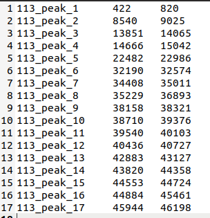

# Sequence_operate

## Overview

The `Sequence_operate` module is part of the WangLab suite of tools and contain several command related to sequence
operations.

## Detailed Description

The `Sequence_operate` module can be called using:

```bash
wanglab {subcommand} ...
```

The following subcommands are supported in the `Sequence_operate` module:

- [extract_seqs](#extract_seqs)

  The `extract_seqs` command takes in one position file and one reference sequence file and extract sequences of the reference within the given positions. The position file should contain 3 columns without headers, each represents name, start and end.

  

  If the position file only contain the name column, `extract_seqs` will extract all sequences that have the same names in the reference sequence file. (In this situation, the reference file usually have multiple sequences, e.g. sequences of all CDS in a genome.)

  It is also possible to do some additional operations after extraction, e.g., output reverse complement sequences, translate into protein sequences (if CDS), etc. See [Command Line Options](# extract_seqs) for more details. 

- [calc_content](#calc_content)

  The `calc_content` command takes in the same position file and reference file as `extract_seqs`, and calculate GC content of each extracted sequences. If other types of nucleotide content are desired, see [Command Line Options](#calc_content) for more details.

- [file_merge](#file_merge)

  The `file_merge` command takes in a folder directory and merge all the files in that folder that are in a given format into a single file. Supported format include fasta (fa, fna, fas, etc.), plain txt and xlsx.

- [oss-util](#oss-util)

  The `oss-util` command takes in a config file and download NGS data. The config file should contain `AccessKeyId`, `AccessKeySecret`, `OSS_path`, `endpoint_path` and `local_dir`, where `local_dir` is the directory that downloaded files are stored. 

- [primer_blast](#primer_blast)

- [primer-generator](#primer-generator)

- [qPCR](#qPCR)

## Command Line Options

### extract_seqs

- `-i` or `--input`: Position file. It should contain 3 columns, each represent sequence name, start position, end position ,respectively. If only 1 column are given, the extraction will be according to sequence names. REQUIRED.
- `-r` or `--reference`: Reference sequence file. If the positions are specified in the position file, sequences within positions of the first sequence in the reference file will be extracted. If only names are specified in the position file, sequences in the reference file that have the same name will be extracted. REQUIRED.
- `-o` or `--ouput`: Output file name. If not specified, will write to standard output.
- `-f` or `--fmt`: Format of position file. Default is tab-separated.
- `-t` or `--tranform`: Whether to transform extracted sequences, default is no.
  - `translate`: Translate from nucleotide sequences into protein sequences.
  - `complement`: Export complement sequences.
  - `complement_rna`: Export complement RNA sequences.
  - `reverse_complement`: Export reverse complement sequences.
  - `reverse_complement_rna`: Export reverse complement RNA sequences.
  - `rna`: Simply substitute ''T" with "U".

### calc_content

- `-i` or `--input`: Position file containing 3 columns: name, start ,end. REQUIRED.
- `-r` or `--reference`: Reference sequence file. Only the first sequence will be used. REQUIRED.
- `-o` or `--output`: Output file name. If not specified, will write to standard output.
- `-n` or `--nucl`: 

### file_merge

- `-d` or `--dir`: Folder directory. REQUIRED.
- `-o` or `--out`: Output file name. If not specified, will write to standard output.
- `-f` or `--fmt`: Format of the input files. Default: `fasta`
  - `fasta` ,`fa`,`fas`,`fna`, `seq`: i.e. fasta format. If one of the above 5 format is specified, all files that ends with **any** of the above will be merged.
  - `xlsx`, `xls`: i.e. Excel format. Files will be merged in the way of adding new sheets.
  - `txt`: Plain text.
  - Other formats are not supported yet.
- `-a` or `--all`: If this parameter is set as True, no matter what format the file is, it will be merged. In some cases it will raise errors. Default: False.

### oss-util

- `-conf` or `--config`: Configure file name. REQUIRED.

### primer_blast

### primer-generator

### qPCR
