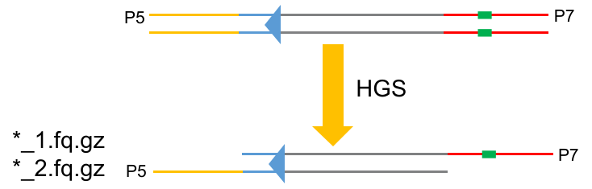

# TIS

## Overview

The `TIS` module is part of the WangLab suite of tools and contain 4 commands which consists a whole analysis workflow of TIS.

## Detailed Description

The `TIS` module can be called using:

```bash
wanglab {subcommand}
```

- [cutadapt](#cutadapt)

  The raw data (*.fq.gz) will remove sequence adaptors, i.e., for pair-end data, P5 sequence of \*\_1.fq.gz and P7 sequence of \*\_2.fq.gz will be removed.

  As fragments may be longer than sequencing length, reads in \*\_2.fq.gz will not reach Tn sequence. Thus, we will only use \*\_1.fq.gz to do the following analysis.

  The `cutadapt` subcommand uses [cutadapt](https://cutadapt.readthedocs.io/en/stable/) to trim 5' Tn and 3' P7 sequence, with the following parameters: 

  - 5': `-O 17 -e 0.2  --match-read-wildcards --discard-untrimmed`
  - 3': `-O 5 -e 0.1 -m 10`

  **Note**: If 5' Tn is not detected, the read will be discarded.

  The `cutadapt` subcommand takes a directory of fq.gz files as input, and produce trimmed files in the same directory, as well as a log file that contains qualities of each trimming process. The log file will not overwrites, thus need to be removed every times before running this subcommand.

  Because `cutadapt` in `ChIP_seq` module is also integrated in this subcommand, when using this in `TIS` module, users need to specified type `-t` as `tn-seq` and plasmid name`-p` as `Tn5` or `pSC189` for different Tn sequences.



- [bowtie](#bowtie)

  After `cutadapt`, we will map trimmed reads to a reference genome. The `bowtie` subcommand takes in a directory of trimmed files and a reference genome file and generate `SAM` format files as well as log files for every inputs. Similar with `cutadapt`, users need to specify data type as `tn-seq` when using this subcommand.

  The `bowtie`subcommand used [bowtie](https://bowtie-bio.sourceforge.net/index.shtml) to map reads to reference genomes, with the following parameters: `-v 3 -a --best --strata -m 1 -q --sam`.

- [count_reads](#count_reads)

  The `count_reads` subcommand takes in a directory of SAM file, an annotation file and several other parameters to tally reads within each annotated features as well as regions between features. The program will first check chromosome name specified by `-c` or `--chrom`. Make sure the name in annotation file is the same as the name used in reference genome file in `bowtie`. Only rows that have correct chromosome name and **CDS** in the third columns will be use to the next step. Secondly, feature names will be extracted by the rule set in `-r` or `--cds`. For example, if the 9th column are in the format of `ID=<feature_name>;`, where `<feature_name>` is the part you want to extract, simply substitute `<feature_name>` with `(.+?)` and set `-r` as `ID=(.+?);` . Note that `;` is necessary because the program need a symbol to end matching. Finally, the `-l` or `--length` is set to determine the region between the last feature and the end of chromosome. 

  **Note**: This program will not take specific nucleotide composition into count, therefore can not reduce false positive rate for pSC189 as some other tools do like [TRANSIT](https://github.com/mad-lab/transit).

- [combine_reads](#combine_reads)

  The `combine_reads` subcommand takes in a directory of csv files generated by `count_reads` and combine them into one excel file. The first three columns are feature name, start positions and end positions. The following columns are reads in different files.


## Command Line Options

### cutadapt

- `-d` or `--dir`: Directory of fq.gz files. If raw data are not end with fq.gz (e.g. fastq.gz), users need to modify [cutadapt.py](../WangLab/TIS/cutadapt.py) line 43. REQUIRED.
- `-t` or `--type`: Data type, `Tn-seq`or `ChIP-seq`. REQUIRED.
- `-p` or `--plasmid`: Transposon plasmid name, `pSC189` or `Tn5`. REQUIRED if `-t` is set as `Tn-seq`.

### bowtie

- `-d` or `--dir`: Directory of trimmed files. This command will automatically recognize files generated by `cutadapt`. REQUIRED.
- `-r` or `--ref`: Reference file path. Multiple references could exist in a single file. REQUIRED.
- `-t` or `--type`: Data type, `Tn-seq` or `ChIP-seq`. REQUIRED.
- `-@` or `--core`: Number of alignment threads to launch. Default if 1.

### count_reads

- `-d` or `--dir`: Directory of SAM files. REQUIRED.
- `-i` or `--annot`: Annotation file, gtf or gff format. REQUIRED.
- `-c` or `--chrom`: Chromosome name of the first column in `annotation file`, need to correspond to the reference genome used in `bowtie`. REQUIRED.
- `-r` or `--cds`: Regular expression used to extract feature names. REQUIRED.
- `-l` or `--length`: Genome length, used to specify the region between the last feature and the end of genome. REQUIRED.

### combine_reads

- `-d` or `--dir`: Directory of csv files.